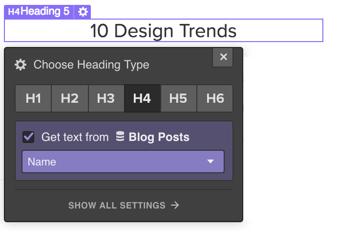

## Custom Post Types Archive Page

**Archive Posts** is an element that can be inserted only in the page set as **Archive for Custom Post Type**. This page must have the following attributes on the body

> page=archive
>
> post-type={your-post type}

## Archive Title
This will be the title of your blog archive. To create it select a Text Block and insert the attribute:

> cpt=archive-title

connect it to the field **name** of the CMS

## Archive Image
This is the image of your archive. You can select a **Div Block** or an **Image**
Insert the attribute:

> cpt=archive-image

Connect the image or the background image to the field **main image** of the CMS

## Archive Description
This is the description of your archive. Select a **Text** element and add the attribute:

> cpt=archive-description

## Archive Posts
It must be inserted on a Collection List Wrapper and it's the list of archive posts. To enable pagination just add the pagination to the collection and you can control the number of posts from *settings --> reading*

The attribute to enter is:

> cpt=archive-posts

All the elements you can add in the Collection Item are available here.

## Taxonomies

Insert a Collection List Wrapper and enter the attribute:

> cpt:taxonomies={taxonomy name

Inside Collection item you can use the following attributes:

#### Description

On Text elements:

> item=description

#### Title

On Text or Link:

> item=title

#### Permalink 

On Link elements:

> item=permalink

#### Featured Image

On Div, Link or img elements:

> item=featured-image

*The following items are available for all the pages of your Webflow project and you're not forced to use them in the Archive page only:*

## Archive Link

This is the link to the Archive page of the post type. Insert the following attribute on link elements:

> cpt=archive-link

## Queried Posts
It's a posts collection you selected using Udesly WordPress plugin from posts queries menu. Insert a Collection lists wrapper and, if you want, you can be pagination.
Insert the attribute:

> cpt:posts={slug of the query in the plugin}`

Inside the Div, all you can use inside collection list item is available here.

## CPT Slider

Insert a Slider item and add the attribute:

> cpt:slider={slug della query nel plugin}

Inside the Slide, all you can use inside collection list item is available here.
