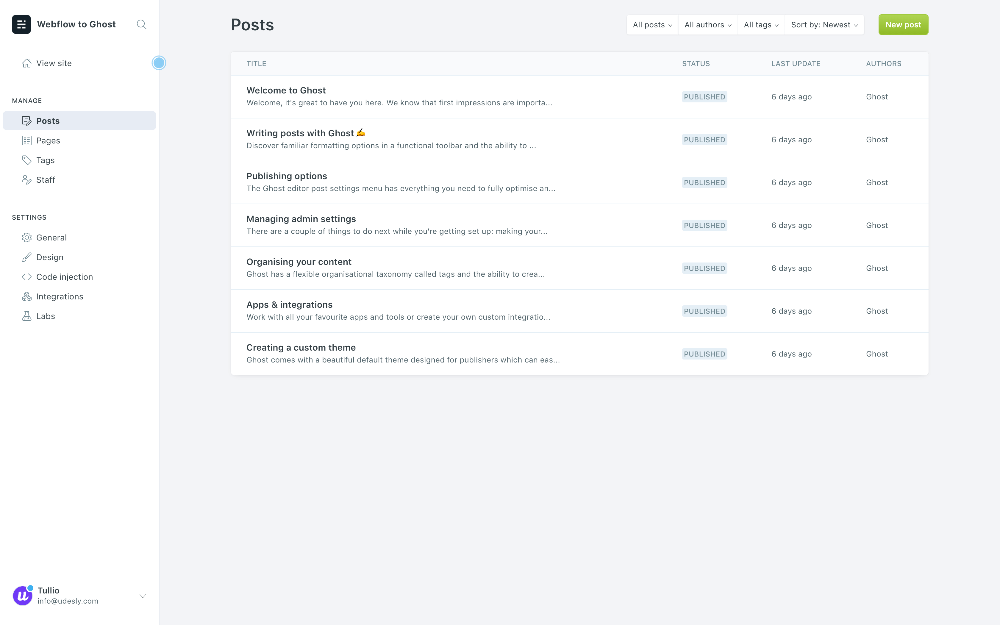

The List page is a type of page that must be used as an archive of posts of your Blog. 

Don't forget to define your page by adding the correspondent attribute on the body of the page in Webflow:

> page=list

<pre>
<video autoplay muted playsinline="true" loop>
<source src="/assets/page-type.webm">
</video>
</pre>

*The following list includes all elements you can enter within this pages.*

> **Tips:**
> Take a look at our [elements pack](https://webflow.com/website/webflow-to-wordpress-elements-pack). It’s a set of all the most used elements with the necessary custom attributes already added. You just need to copy and paste the element in your Webflow page and give it your own style. This will help you quicken the workflow. If you have already completed your design and just want to convert the project to WordPress, maybe the quicker way to proceed is to add the custom attributes manually following our guide.
>
> Otherwise, if you want to start from scratch, follow the guide below.

## Archive Title

This is the list page title it can be added on any text element both in List Page and Tag Page.

The attribute to enter is:

> blog=archive-title

## Archive Posts

It must be inserted on a Collection List Wrapper and it's the list of your posts. To enable pagination follow this Ghost [guide](https://ghost.org/docs/api/v2/handlebars-themes/helpers/pagination/) in order to add the pagination to the collection and control the number of posts.

The attribute to enter is:

> blog=posts

**It can be used in List and Tag pages exclusively.**

All the elements you can add in the Collection Item are available below:

    
- ### Featured Image
    It's the featured image of the post. It can be added to an image or to any other element as background image, will also add the link if set on a link block.
    Insert the attribute:

    > item=featured-image

- ### Title
    It's the title of the post and can be added to any text element, will also add the link if set on a link text.
    Insert the attribute:

    > item=title

- ### Excerpt
    It's the excerpt of the post and can be added to any text element. Insert the attribute:

    > item=excerpt

    There are some optional parameters that allow to handle the excerpt. Manage the number of words you want the excerpt is made up by adding this optional attribute:

    > words={number of words}

    To manage the number of characters:

    > characters={number of characters}

    Obviously, one precludes the other.    

- ### Tags
    It shows tags of the post and it must be added on a link element. This one will be repeated and if the link is inside a **List Item**, the whole List Item will be repeated.
    Insert the following attribute on the Link element:

    > item=tags

    Optionally, you can define the separator amongst tags by adding the attribute

    > separator={your separator}

    For example, we want to separate tags by |. We add the attribute:

    > separator=|

    This tags list creates links pointing to tags. You can disable this feature by adding this attribute:

    > autolink=false

    Or you can limit the number of tags through this attribute:

    > limit={number of tags you want to show}    

- ### Authors
    It shows authors of the post and it must be added on a link element. This one will be repeated and if the link is inside a **List Item**, the whole List Item will be repeated.
    Insert the following attribute on the Link element:

    > item=authors

    Optionally, you can define the separator amongst authors by adding the attribute

    > separator={your separator}

    For example, we want to separate authors by |. We add the attribute:

    > separator=|

    This authors list creates links pointing to tags. You can disable this feature by adding this attribute:

    > autolink=false

    Or you can limit the number of authors through this attribute:

    > limit={number of tags you want to show}

- ### ID
    If you want to show the post ID as element ID, insert a Text element and add the attribute:

    > item=id

- ### Content
    This is the content of the post. Insert a Text element and add the attribute:

    > item=content

- ### Meta Title
    This is the custom meta title for the post. Insert a Text element and add the attribute:

    > item=meta-title

- ### Meta Description
    This is the custom meta description for the post. Insert a Text element and add the attribute:

    > item=meta-description

- ### Url
    This is the web address for the post page. Insert a Link element and add the attribute:

    > item=url

- ### Date

    It is the date of publication of the post. Insert a text element and enter the attribute:

    > item=date    

- ### Published at
    This is the date and time when the post was published. Insert a Text element and add the attribute:

    > item=published-at

- ### Updated at
    This is the date and time when the post was last updated. Insert a Text element and add the attribute:

    > item=updated-at

- ### Created at
    This is the date and time when the post was created. Insert a Text element and add the attribute:

    >item=created-at

**Date - Published at - Updated at - Created at** may include 2 optional attributes:

**Format:** you can select the date format by choosing in this [library](https://momentjs.com/docs/#/displaying/format/). Insert the attribute:

> format={your format}

**Time ago:** you can show how long it's been since the post publication, update or creation. Insert the attribute:

> timeago=true

---------
> **Take in Mind**
>
> In our documentation you will find custom attributes in 2 formats:
>
> **name=value** or **name={dynamic-value}**
>
>
> **Attribute**             | **Meaning** | 
> -------------             | --------------- |
> | item=title              | *item* is the *Name* and *title* is the *Value* |
> | dimension={dimension}   | *dimension* is the *Name* and instead of {dimension} you have to insert one of the accepted value that you'll find indicated each time. For example dimension can be *master*|