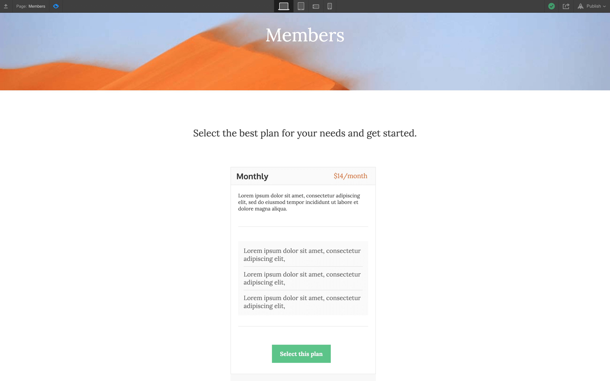

You can turn your members into paying subscribers with straightforward subscriptions and start generating predictable revenue.
Once you have a way for members to sign in to your site, you can then ask them to support your work with recurring subscriptions.

> **Tips:**
> Take a look at our [elements pack](https://webflow.com/website/webflow-to-wordpress-elements-pack). It’s a set of all the most used elements with the necessary custom attributes already added. You just need to copy and paste the element in your Webflow page and give it your own style. This will help you quicken the workflow. If you have already completed your design and just want to convert the project to WordPress, maybe the quicker way to proceed is to add the custom attributes manually following our guide.
>
> Otherwise, if you want to start from scratch, follow the guide below.

Subscriptions can be purchased in two different ways:

## Buy Monthly
Insert a Link element wherever you want into your site and assign it the following attribute:

> members=buy-monthly

Optionally you can add a Text element with the attribute:

> members=price-monthly

## Buy Yearly
Insert a Link element wherever you want into your site and assign it the following attribute:

> members=buy-yearly

Optionally you can add a Text element with the attribute:

> members=price-yearly

## Subscription Page
Insert a Collection List Wrapper and add the following attribute:

> members=subscriptions

*The following list includes all elements you can enter within this Collection List.*

> item=id

> item=member-id

> item=member-name

> item=member-email

> item=plan-id

> item=plan-name

> item=plan-interval

> item=plan-currency

> item=plan-amount

> item= plan=status

> item=card-digits

> item=start-date

> item=current-period-end

**Start Date - Current Period End** may include 2 optional attributes:

**Format:** you can select the date format by choosing in this [library](https://momentjs.com/docs/#/displaying/format/). Insert the attribute:

> format={your format}

---------
> **Take in Mind**
>
> In our documentation you will find custom attributes in 2 formats:
>
> **name=value** or **name={dynamic-value}**
>
>
> **Attribute**             | **Meaning** | 
> -------------             | --------------- |
> | item=title              | *item* is the *Name* and *title* is the *Value* |
> | dimension={dimension}   | *dimension* is the *Name* and instead of {dimension} you have to insert one of the accepted value that you'll find indicated each time. For example dimension can be *master*|