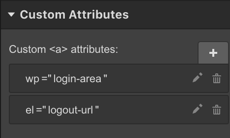
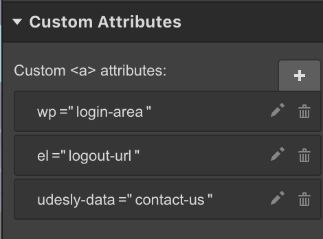

## How to create a Logout action

You can use a **Text Link**, a **Link Block** or a **Button** and insert the attributes:

> wp=login-area
>
> el=logout-url

With this configuration, the logout will redirect to the Home page. If you need to redirect to another given page, you have to use the attribute udesly-data and set the slug of that page as value. E.g. if you want to redirect to the Contact Us page, you have to insert the attribute:

> udesly-data=contact-us.

**Best practice:** it would be preferable to wrap this logout element in a div with attributes:

> wp=conditional
>
> el=user-status
>
> udesly-data=true

This configuration hides the logout element if the user is not logged-in.

<iframe width="700" height="419" src="https://www.youtube.com/embed/ei5h0EdQDA4?list=PLLChkVtVa_ZuGrgLVMEIl0nliPjljc4gm" frameborder="0" allow="accelerometer; autoplay; encrypted-media; gyroscope; picture-in-picture" allowfullscreen></iframe>
