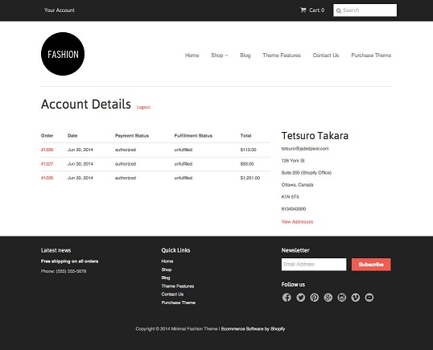

In this guide we’re going to focus on how to configure the account page in Webflow to get it ready to be converted to Shopify by the Adapter. 

This page is defined with the following attribute attached to the Body:

> page=account

<pre>
<video autoplay muted playsinline="true" loop>
<source src="/assets/page-type.webm">
</video>
</pre>

To enable accounts follow the path **Shopify > settings > Checkout > Select**. 

> **Tips:**
> Take a look at our [elements pack](https://preview.webflow.com/preview/webflow-to-shopify-elements?utm_medium=preview_link&utm_source=designer&utm_content=webflow-to-shopify-elements&preview=71280fc62c37d44b2222bbe7b9a3e953&mode=preview). It’s a set of all the most used elements with the necessary custom attributes already added. You just need to copy and paste the element in your Webflow page and give it your own style. This will help you quicken the workflow. If you have already completed your design and just want to convert the project to Shopify, maybe the quicker way to proceed is to add the custom attributes manually following our guide.
>
> Otherwise, you can start from scratch, floowing the guide below.

 **The following elements can be entered in the Account page only.** 

These are the most common elements of an account page. For each element, you can find the custom attribute that you must add in Webflow to allow a proper conversion by the Adapter.

## User Name
Insert a Text item and add the attribute:

> account=user-name

## User First Name
Insert a Text item and add the attribute:

> account=user-first-name

## User Last Name
Insert a Text item and add the attribute:

> account=user-last-name

## User Email
Insert a Text item and add the attribute:

> account=user-email

## User Orders Count
If you want to display the number of orders a user has placed in the shop, insert a Text Item in the account page of your Webflow project and add the attribute:

> account=user-orders-count

## User Default Address
Shopify gives you the opportunity to add several shipping addresses and set one of them as main address: this is the Default address.

In Webflow, insert a Text item and add the attribute:

> account=user-default-address

## User Total Spent
if you want to display the total spent by customer on the shop, insert a Text item in the account page of your Webflow project and and add the attribute:

> account=user-total-spent

## Orders

If you want to list the customer’s orders in the account page, just add a Collection List Wrapper item in Webflow and add the attribute:

> account=orders

In this way the main info about the customer’s orders will be displayed dinamically after the conversion to Shopify (screenshot).
To paginate the Collection list just enable pagination on that collection list *(Webflow Designer > Element setting panel > Paginate Items)*.
Once converted your Webflow template to Shopify, you’ll be able to control the number of orders per page from *Shopify -> Online Store > Themes > Customize*.

Inside each single collection item you can add the following attributes on Text elements:

> item=name
> 
> item=date
> 
> item=payment-status
>
> item=fulfillment-status
>
> item=total  

On Link elements:

> item=link

## Logout Link
you can enable the “log out link” on all the pages in your Webflow project. To do so you need to insert a Link item on the Webflow page where you want to enable the log out link and add the attribute:

> account=logout-link

---------
> **Take in Mind**
>
> In our documentation you will find custom attributes in 2 formats:
>
> **name=value** or **name={dynamic-value}**
>
>
> **Attribute**             | **Meaning** | 
> -------------             | --------------- |
> | item=title              | *item* is the *Name* and *title* is the *Value* |
> | dimension={dimension}   | *dimension* is the *Name* and instead of {dimension} you have to insert one of the accepted value that you'll find indicated each time. For example dimension can be *master*|