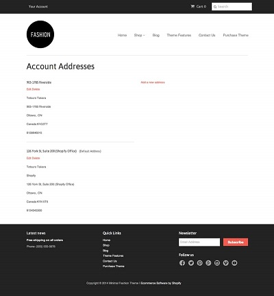

The following elements can be entered in the **Addresses page** only. This page is defined with the following attribute attached to the Body:

> page=addresses

Here you can modify or see user addresses.

<pre>
<video autoplay muted playsinline="true" loop>
<source src="/assets/page-type.webm">
</video>
</pre>

> **Tips:**
> Take a look at our [elements pack](https://webflow.com/website/webflow-to-shopify-elements). It’s a set of all the most used elements with the necessary custom attributes already added. You just need to copy and paste the element in your Webflow page and give it your own style. This will help you quicken the workflow. If you have already completed your design and just want to convert the project to Shopify, maybe the quicker way to proceed is to add the custom attributes manually following our guide.
>
> Otherwise, you can start from scratch, following the steps below.

## Addresses
Insert a Collection List Wrapper and add the attribute:

> item=addresses

It allows pagination, you can configure addresses pagination setup from **Shopify-->Customize Theme.**

In each Collection Item there must be a Form, the form needs the following fields:

 | **Type** | 
 | --------------- |
 | label |
 | plain |
 | select |
 | submit |

## New Address
Insert a Form block and add the attribute.

> item=new-address

The form needs the following fields:

 | **Type** | 
 | --------------- |
 | label |
 | plain |
 | select |
 | submit |

---------
> **Take in Mind**
>
> In our documentation you will find custom attributes in 2 formats:
>
> **name=value** or **name={dynamic-value}**
>
>
> **Attribute**             | **Meaning** | 
> -------------             | --------------- |
> | item=title              | *item* is the *Name* and *title* is the *Value* |
> | dimension={dimension}   | *dimension* is the *Name* and instead of {dimension} you have to insert one of the accepted value that you'll find indicated each time. For example dimension can be *master*|