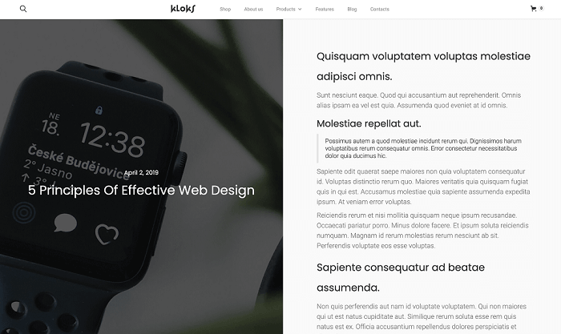

Here you can find a list of all elements you can enter within the **Single Article** page of your Shopify site.

This page must have the following attribute on the Body:

> page=article

<pre>
<video autoplay muted playsinline="true" loop>
<source src="/assets/page-type.webm">
</video>
</pre>

> **Tips:**
> Take a look at our [elements pack](https://webflow.com/website/webflow-to-shopify-elements). It’s a set of all the most used elements with the necessary custom attributes already added. You just need to copy and paste the element in your Webflow page and give it your own style. This will help you quicken the workflow. If you have already completed your design and just want to convert the project to Shopify, maybe the quicker way to proceed is to add the custom attributes manually following our guide.
>
> Otherwise, you can start from scratch, following the guide below.

## Date
It is the date of publication of the article. Insert a text element and enter the attribute:

> item=date

To handle the date format, you can use the following optional attribute:

> [format={date-format}](shopify-optional-filters#date-format)

*For further info on how to set this optional attribute, please take a look on this [document](shopify-optional-filters)*

## Featured Image
It's the featured image of the article. It can be added to an image or to any other element as background image, will also add the link if set on a link block.
Insert the attribute:

> item=featured-image

To handle featured image settings, there are several optional attributes you can use.

> [dimension={dimension}](shopify-optional-filters#dimension)

> [scale={scale}](shopify-optional-filters#scale)

> [format={format}](shopify-optional-filters#format)

> [crop={crop}](shopify-optional-filters#crop)

*For further info on how to set these optional attributes, please take a look on this [document](shopify-optional-filters)*

## Title
It's the title of the article and can be added to any text element, will also add the link if set on a link text.
Insert the attribute:

> item=title

## Excerpt
It's the excerpt of the article and can be added to any text element.
Insert the attribute:

> item=excerpt

## Tags
It shows tags of the article and it must be added on a link element. This one will be repeated and if the link is inside a **List Item**, the whole List Item will be repeated.
Insert he attribute:

> item=tags

## Author Email
It can be set on a text element or a link, if set on a link it will be a mailto:

Insert the attribute:

> item=author-email

## Author
It displays author first name and last name and links to author home page and can be set on a text element or a link.
Insert the attribute:

> item=author

## Author Bio
It's the biography of the author and can be set on a text element.
Insert the attribute:

> item=author-bio

## Avatar
It's the image of the author but only if uploaded also in Shopify will not get gravatar. It can be set on a image or div.
Insert the attribute:

> item=avatar

## Content
It's the content of the post and can be set on a richtext element.
Insert the attribute:

> item=content

## Navigation
These elements help you to browse among posts:

- ### Previous Article
  To create a link to the previous article, insert a Link or a button item and assign the attribute:

  > item=previous-article

- ### Next Article
  To create a link to the next article, insert a Link or a button item and assign the attribute:

  > item=next-article

---------
> **Take in Mind**
>
> In our documentation you will find custom attributes in 2 formats:
>
> **name=value** or **name={dynamic-value}**
>
>
> **Attribute**             | **Meaning** | 
> -------------             | --------------- |
> | item=title              | *item* is the *Name* and *title* is the *Value* |
> | dimension={dimension}   | *dimension* is the *Name* and instead of {dimension} you have to insert one of the accepted value that you'll find indicated each time. For example dimension can be *master*|