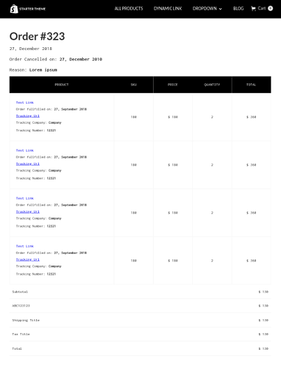

The Order page is used to display the details of a visitor’s past order. The following elements can be set only on the **Order page**.

 This page is defined with the following attribute attached to the Body:

> page=order

<pre>
<video autoplay muted playsinline="true" loop>
<source src="/assets/page-type.webm">
</video>
</pre>

Check this [link](https://help.shopify.com/en/manual/checkout-settings/customer-accounts) to see how to enable accounts on Shopify.

> **Tips:**
> Take a look at our [elements pack](https://webflow.com/website/webflow-to-shopify-elements). It’s a set of all the most used elements with the necessary custom attributes already added. You just need to copy and paste the element in your Webflow page and give it your own style. This will help you quicken the workflow. If you have already completed your design and just want to convert the project to Shopify, maybe the quicker way to proceed is to add the custom attributes manually following our guide.
>
> Otherwise, you can start from scratch, following the steps below.

#### Order Date

It is the date of publication of the order. Insert a text element and enter the attribute:

> item=date

To handle the date format, you can use the following optional attribute:

> [format={date-format}](shopify-optional-filters#date-format)

*For further info on how to set this optional attribute, please take a look on this [document](shopify-optional-filters)*

#### Cancel Date
It is the date of cancellation of the order. Insert a text element and enter the attribute:

> item=cancelled-date

To handle the date format, you can use the following optional attribute:

> [format={date-format}](shopify-optional-filters#date-format)

*For further info on how to set this optional attribute, please take a look on this [document](shopify-optional-filters)*

#### Cancel Reason
This is the reason behind the cancellation of the order. Insert a Text item and add the attribute:

> item=cancel-reason

#### Billing Address
Insert a Text item and add the attribute:

> item=billing-address

#### Shipping Address
Insert a Text item and add the attribute:

> item=shipping-address

#### Subtotal
Insert a Text item and add the attribute:

> item=subtotal

#### Total
Insert a Text item and add the attribute:

> item=total

#### Taxes
Insert a Div element that gets repeated and add the attribute:

> item=taxes

    Inside you can add on Text items:
    
    > item=tax-title

    and

    > item=tax-price

#### discounts
Insert a Div element that gets repeated and add the attribute:

> item=discounts

    Inside you can add on Text items:
    
    > item=discount-code

    and

    > item=discount-savings

#### shipping
Insert a Div element that gets repeated and add athe attribute:

> item=shipping

    Inside you can add on Text items:
    
    > item=shipping-title

    and

    > item=shipping-price

#### Name
Insert a Text item and add the attribute:

> item=name

#### Items
Insert a Collection List wrapper and add the following attribute:

> item=items

Inside the Collection List item you can add the following attributes, attached to a text item:

> item=title
>
> item=tracking-company
>
> item=sku
>
> item=quantity
>
> item=total
>
> item=item-price

Attached to a link item:

> item=tracking-url
>
> item=link

---------
> **Take in Mind**
>
> In our documentation you will find custom attributes in 2 formats:
>
> **name=value** or **name={dynamic-value}**
>
>
> **Attribute**             | **Meaning** | 
> -------------             | --------------- |
> | item=title              | *item* is the *Name* and *title* is the *Value* |
> | dimension={dimension}   | *dimension* is the *Name* and instead of {dimension} you have to insert one of the accepted value that you'll find indicated each time. For example dimension can be *master*|