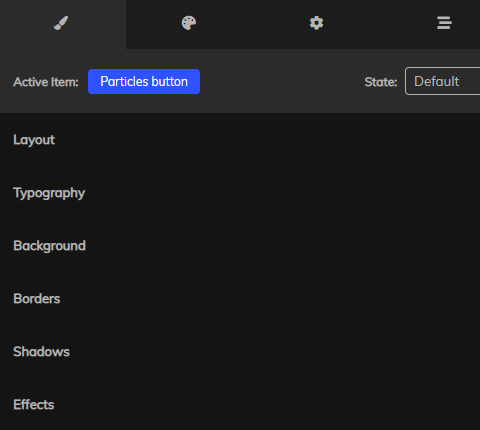
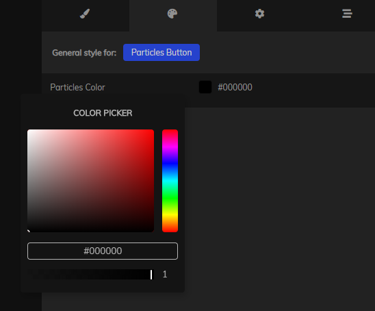
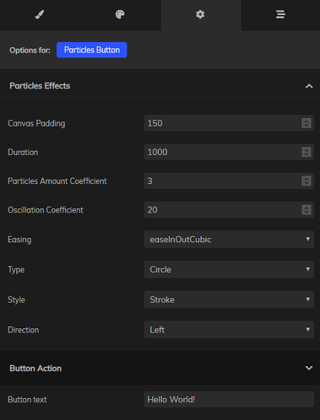
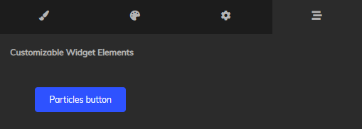

## Customize widgets for Webflow
 
 
<iframe width="100%" height="350px" src="https://www.youtube.com/embed/wCQHbNhZfoY" frameborder="0" allow="accelerometer; autoplay; encrypted-media; gyroscope; picture-in-picture" allowfullscreen></iframe>

 
 Udesly has recently introduced a list of Webflow widgets that allow users to add advanced features that, otherwise, are not available among the native Webflow properties.
 
 The Udesly Styler is a control panel for customizing these advanced elements.
 
 Let's make a general overview of the characteristics of this tool and how it presents itself to our eyes.
 
 In the first place we find a canvas showing the preview of the effect we've chosen (in this case we're working on a button particles effect).
 

 
 Udesly Styler is altogether responsive. It makes you able to work in Desktop - Tablet - Mobile landscape - Mobile portrait
 

 
 Available commands are really very simple. On the left we find a minimal menu that manages some features. Instead, a much more detailed menu is placed on the right. It represents the true core of the Styler.
 
 But let's start with the left menu.
 

 It consists of a few but important items that, scrolling from above, are:
 
 The Udesly logo that leads directly to our official website;
 
 A back to ... arrow that leads to the single product page of the selected widget;
 
 A Cart icon that leads to the shop page;
 
 A little sun that allows to enable the light mode. Obviously, when it is active, the sun will turn into a romantic moon, on which click to return to the dark mode. Take a look:
 
 
 It is time now to analyze the menu on the right which, as mentioned, is the fulcrum of the Styler. It consists of 4 dynamic panels. This means that the various elements change depending on the chosen widget.
 
 The First panel allows to stylize the single selected element of the widget. By clicking on it, the entries of all possible customizations will appear (layout, typography, borders, shadows, etc.).
 
 

 The second panel guarantees the dynamic customization of the style of the widget general elements.
 

 
 The third is a widget options panel. Here you do not customize the style but the settings such as animation effects, the direction, the duration and so on.
 
 It is unique for each single widget.
 

 Lastly, there is the Navigator. It is a utility menu that allows to make a summary of all the widget elements.
 

 
 In the lower right corner of the Styler we find other very important functions. First of all there is the autosave function that allows you not to lose the work done.
 
 And there's the **EXPORT** button. By clicking on it, the software will generate a code that you will only have to insert as embed code in the page of your project. The list of widgets that you can find on [https://www.udesly.com/](Udesly) contains both freebies and paid widgets. Obviously, if you want to export one of the latter, you need to buy it on our site before starting work on it.
 
