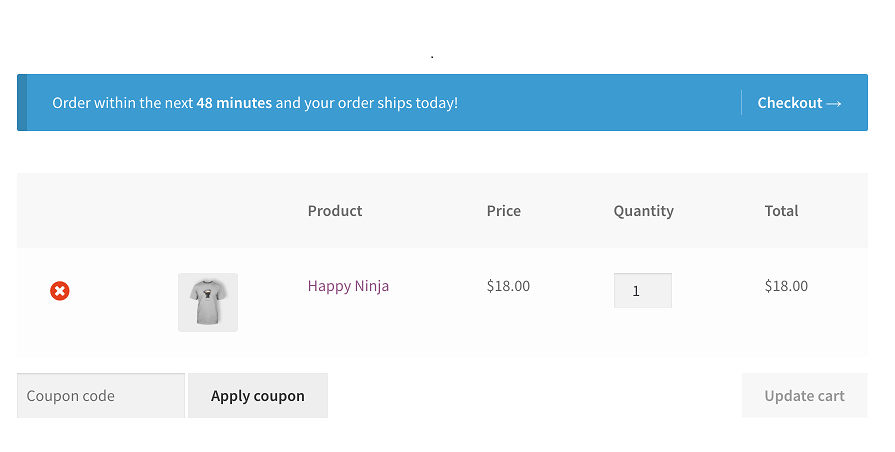

WooCommerce Cart page shows the cart content. This page does not require any attribute in the body.

> **Tips:**
> Take a look at our [elements pack](https://preview.webflow.com/preview/webflow-to-shopify-elements?utm_medium=preview_link&utm_source=designer&utm_content=webflow-to-shopify-elements&preview=71280fc62c37d44b2222bbe7b9a3e953&mode=preview). It’s a set of all the most used elements with the necessary custom attributes already added. You just need to copy and paste the element in your Webflow page and give it your own style. This will help you quicken the workflow. If you have already completed your design and just want to convert the project to WordPress, maybe the quicker way to proceed is to add the custom attributes manually following our guide.
>
> Otherwise, if you want to start from scratch, follow the guide below.

## Cart
Insert a Form block with the following attribute added to it:

> wc=cart

The form needs the following input fields: 

- 1 **Text** input with the attribute:
> item=coupon

- 2 **Submit** items with the attributes, respectively:
> item=apply-coupon

> item=update-cart

The form must contain a Collection List whose items will be:

### Featured Image
It can be added to an image or to any other element as background image, will also add the link if set on a link block.

Insert the attribute:

> item=featured-image

### Title
It's the title of the product and can be added to any text element, will also add the link if set on a link text.

Insert the attribute:

> item=title    

### Permalink
Insert a link element and add the attribute:

> item=permalink

### Price
Insert a Text element and add the attribute:

> item=price

### Subtotal
Insert a Text element and add the attribute:

> item=subtotal         

### Remove
Insert a link element and add the attribute:

> item=remove

### Variation
If you want to show variations of a given variable product purchased by the user within the Cart page, insert a Text element and add the attribute:

> item=variation

### Quantity
Insert an Input type number and add the attribute:

> item=quantity

## Cart Totals
It displays cart info such as total, txes, shipping, coupons, etc..

Insert a Div element with the attribute:

> wc=cart-totals

Within it add another Div with the attribute:

> item=line

It must contain 2 Text elements with attributes, respectively:

> item=line-label

> item=line-value

The parent Div must contain also a button with the attribute:

> item=checkout

## Cart Cross Sells
Cross-sells are products that you promote in the cart, based on the current product, usually complemented with each other.

Insert a Collection List Wrapper that will be the list of cross sells products. You can't enable pagination but you can control the number of products from Udesly > Settings > WooCommerce

Add the following attribute on the Collection List Wrappers:

>wc=cart-cross-sells 

---------
> **Take in Mind**
>
> In our documentation you will find custom attributes in 2 formats:
>
> **name=value** or **name={dynamic-value}**
>
>
> **Attribute**             | **Meaning** | 
> -------------             | --------------- |
> | item=title              | *item* is the *Name* and *title* is the *Value* |
> | dimension={dimension}   | *dimension* is the *Name* and instead of {dimension} you have to insert one of the accepted value that you'll find indicated each time. For example dimension can be *master*|