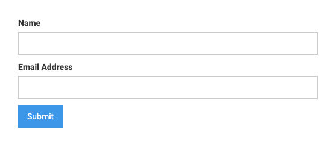

You can add a Webflow form in your WordPress site. Forms can be added in any page of your project.

> **Tips:**
> Take a look at our [elements pack](https://preview.webflow.com/preview/webflow-to-shopify-elements?utm_medium=preview_link&utm_source=designer&utm_content=webflow-to-shopify-elements&preview=71280fc62c37d44b2222bbe7b9a3e953&mode=preview). It’s a set of all the most used elements with the necessary custom attributes already added. You just need to copy and paste the element in your Webflow page and give it your own style. This will help you quicken the workflow. If you have already completed your design and just want to convert the project to Shopify, maybe the quicker way to proceed is to add the custom attributes manually following our guide.
>
> Otherwise, if you want to start from scratch, follow the guide below.

Insert a **Form Block** element and customize it as you prefer.

Select the Form Block from the Navigator and insert this attribute:

> wordpress=form

Webflow does no longer export Forms functionality, if not hosted on its server, but you can decide to use WordPress to manage them.

Forms will be sent via email to the admin.

---------
> **Take in Mind**
>
> In our documentation you will find custom attributes in 2 formats:
>
> **name=value** or **name={dynamic-value}**
>
>
> **Attribute**             | **Meaning** | 
> -------------             | --------------- |
> | item=title              | *item* is the *Name* and *title* is the *Value* |
> | dimension={dimension}   | *dimension* is the *Name* and instead of {dimension} you have to insert one of the accepted value that you'll find indicated each time. For example dimension can be *master*|