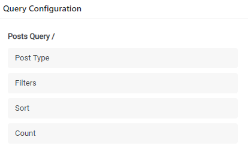
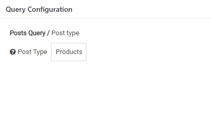
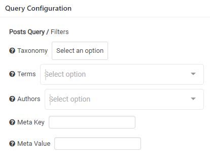
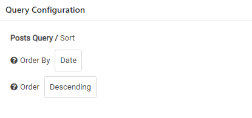
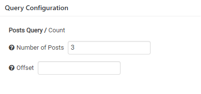

Post queries retrieve posts from the database, using different parameters, so that they can be displayed on the frontend.

With the Udesly plugin you can create posts queries easily and this section of the documentation will show how to create posts queries, that can be used to show posts inside the following elements:
- [Blog queried posts](wordpress-blog-archive-page#queried-posts)
- [Blog Slider](wordpress-blog-misc#blog-slider)
- [CPT queried posts](wordpress-cpt-misc#queried-posts)
- [CPT Slider](wordpress-cpt-misc#cpt-slider)

Click on **Add new post query** button, you'll find several fields helping you to define the post you want to display.

**N.B.** Remember to assign the same name as the one you have assigned in Webflow! 

## Post Type
Here you can select the post type you want to display (posts, products, pages, etc.) 

## Filters
Based on the post type you selected in the previous section, here you can filter it based on a taxonomy, a term, the author or the meta key and mata value, if present.

 - Taxonomy: it allows to filter the selected post type based on a specific taxonomy such as categories or tags;
 - Terms: it allows to filter the selected post type based on a specific term contained it the taxonomy you have choosen;
 - Authors: here you can view all the post types belonging to a specific author;
 - Meta Key: it is the name of a custom field of the post you're searching; 
 - Meta Value: it is the value corresponded to the key you have choosen above.

## Sort
This section allows to order post types based on different criteria: date, title, slug, ID and choose to show them in a descending or ascending order.

## Count
Here you can define the number of post types to display. By default it is set on 3. 

Furthermore, the **Offset** option allows to skip a given number of post types, if you need.

---------
> **Take in Mind**
>
> In the Udesly plugin you can visually control what you are doing by simply clicking on the preview button 
>
> 